<h1 align="center">PROJECT REPORT :100:</h1>

<h2 align="center">Happy Bookstore
    
</h2>

## Members:
- [Tran Van Tien - ITITIU19218](https://www.facebook.com/profile.php?id=100010644854591)
- [Tran Trung Kien - ITITIU19021](https://www.facebook.com/kyun.iam)
- [Hoang Trung Phong - ITITIU19179](https://www.facebook.com/hoang.trungphong.94)

## Table of Contents:
* [Chapter I:Project Description](#project-description)
    * [Project Overview](#project-overview)
    * [The Purpose of the Project](#purpose)
        * [Motivation](#motivation)
        * [Objection](#objection)
        * [Scope](#scope)
* [Chapter II:Technology](#technology)
    * [Section 1: HTML/CSS](#html-css)	
    * [Section 2: MySQL Workbench](#MySQL)
    * [Section 3: JavaScript](#javascript)
    * [Section 4: Node & ExpressJS](#node-expressjs)
* [Chapter III: Requirement Analysis](#requirement-analysis)
    * [Section 1: Functional and Non – Functional requirements](#functional)
    * [Section 2: Risk Register](#risk-register)
    * [Section 3: Resource Requirement](#resource-requirement)
        * [Section 3.1: Hardware Resources](#hardware)
        * [Section 3.2: Software Resources](#software)
        * [Section 3.3: Human Resources](#human)
* [Chapter IV: System Architecture](#system-architecture)
    * [Section 1: Use Case Diagram](#use-case)
    * [Section 2: Use Case Description](#use-case-des)
    * [Section 3: Activity Diagram](#activity)
    * [Section 4: Class Diagram](#class)
    * [Section 5: Sequence Diagram](#sequence)
    * [Section 6: Sequence Diagram overall](#sequence-overall)
* [Chapter V: Implementation](#implementation)
    * [Section 1: Software Processing Model](#model-processing-model)
    * [Section 2: Execution](#execution)
* [Chapter VI: Testing](#testing)
* [Chapter VII: Conclusion](#conclusion)
* [Chapter VIII: References](#references)

<h2 id="project-description">Project Description</h2>
<h3 id="project-overview">Project Overview</h3>

- Personalizing your expertise has become the newest slogan of all school giants. There are many online bookstores like Powell’s, Amazon which were designed using Html. With the intention of making our own bookstores website,  we develop a similar one using NodeJS, MYSQL Workbench.

- Online Book store is an online web application where the customer can purchase books online. In the web browser, the customers can search for a book by its respective categories which based on subject Author, Title, Price, etc., later can add to the shopping cart and finally purchase using credit card transaction. The user can login using his account details or new customers can set up an account very quickly. They should give the details of their name, contact number and shipping address. 

<h3 id="purpose">The Purpose of the Project </h3>
<h4 id="motivation">Motivation</h4>
The motivation to create this project has many sources:
- Interest to develop a good user friendly website with many online transactions
using a database.
- To increase my knowledge horizon in technologies like NodeJS,JS, Handlebars, MySQL Workbench, CSS, HTML.
- To gain good experience in NodeJs before joining an internship.. 
<h4 id="objection">Objection</h4>
The goal is to create an application that will allow you to be apart from standing in line and waiting for a store clerk to eventually check out your products. Online purchases are completed promptly, giving you more time to complete other chores! Furthermore, unlike at a store, courteous customer service experts are accessible 24 hours a day, seven days a week to assist you with locating, purchasing, and delivering your product.
The major goal is to create a bookshop where consumers can come at any time of day from anywhere and examine the available books, pick any of them, and purchase by paying online or by cash on delivery. The administrator will regularly add any new books available to them for sale. The administrator will take books from the reputed publishers and vendors only.
<h4 id="scope">Scope</h4>
- Understand and prepare detailed requirement and specifications
- Prepare high level and detailed design specifications of the system
- Prepare Test Plan and Test cases
- Develop the system and coding
- Perform unit testing, integration and system testing
- Demonstrate a bug free application after suitable modification if needed.
<h3 id="technology">Technology</h3>
<h4 id="html-css">HTML/CSS</h4>
<h5>HTML</h5>
Hypertext Markup Language, or HTML, is the standard markup language for documents designed to be viewed in a web browser. It can be supported by technologies such as Cascading Style Sheets (CSS) and scripting languages ​​such as JavaScript. Web browsers receive HTML documents from a web server or from local storage and convert the documents into multimedia web pages. HTML describes the structure of a website semantically and originally contained information on the appearance of the document. HTML elements are the building blocks of HTML pages. Images and other objects such as interactive forms can be embedded in the rendered page. HTML provides a means of creating structured documents by denoting the structural semantics of text, such as headings, paragraphs, lists, links, quotations, and other elements. HTML elements are separated by tags that are written in angle brackets.
<h5>CSS</h5>
Cascading Style Sheets (CSS) is a stylesheet language used to describe the presentation of a document written in a markup language such as HTML. CSS is a core technology of the World Wide Web, along with HTML and JavaScript. CSS is designed to allow separation between presentation and content, including layout, colors, and fonts.  This separation can improve the accessibility of content; provide greater flexibility and control in the specification of presentation functionality; allow multiple web pages to share formatting by specifying relevant CSS in a separate .css file, reducing complexity and repetition of structural content; and enable caching of .css files to improve page loading speed between pages sharing the file and its formatting.
<h4 id="MySQL">MySQL Workbench</h4>
MySQL Workbench is a software application that is used for configuring, managing, administering, and integrating SQL development. The instrument includes both scripting editors and graphical tools that work with objects and server features.
 In this project, we apply the MySQL Workbench to implement the entities and the relationship between those. All of this supports managing the shopping online system effectively.
<h4 id="javascript">Javascript</h4>
 In this project, we apply the MySQL Workbench to implement the entities and the relationship between those. All of this supports managing the shopping online system effectively.
JavaScript (JS) is a lightweight, interpreted, or just-in-time compiled programming language with first-class functions. While it is most well-known as the scripting language for Web pages, many non-browser environments also use it, such as Node.js, Apache CouchDB and Adobe Acrobat. JavaScript is a prototype-based, multi-paradigm, single-threaded, dynamic language, supporting object-oriented, imperative, and declarative (e.g. functional programming) styles. etc
<h4 id="node-expressjs">Node & ExpressJS</h4>
<h5>Node</h5>
Node.js is an open-source and cross-platform JavaScript runtime environment. It is a popular tool for almost any kind of project.
A Node.js app runs in a single process, without creating a new thread for every request. Node.js provides a set of asynchronous I/O primitives in its standard library that prevent JavaScript code from blocking and generally, libraries in Node.js are written using non-blocking paradigms, making blocking behavior the exception rather than the norm.
Node.js has a unique advantage because millions of frontend developers that write JavaScript for the browser are now able to write the server-side code in addition to the client-side code without the need to learn a completely different language.
<h5>Express Handlebars</h5>
Handlebars.js is a templating engine similar to the ejs module in node.js, but more powerful and simple to use. It ensures minimum templating and is a logicless engine that keeps the view and the code separated. It can be used with express as the hbs module, available through npm. HandleBars can be used to render web pages to the client side from data on the server-side.
<h3 id="requirement-analysis">Requirement Analysis</h3>
<h4 id="functional">Functional and Non – Functional requirements</h4>

| Req.ID | Requirement Name | Detailed Description | Type |
| --- | --- | --- | --- |
| 001 | Register an account | If the user doesn’t have an account, then he will be asked to register. | Functional requirement |  
| 002 | Log in | If the customer or manager already had an account, they can log in. | Functional Requirement |
| 003 | Change password | Allow users  to change their password. | Functional Requirement |
| 004 | Categories | Allow customers to view all the products that are the same type or from a brand. | Functional Requirement | 
| 005 | Filter by products | Allow customers to search for products by keyword. | Functional Requirement |
| 006 | WishLists | Allow customers to add the products that will be released soon or wait to restock. | Functional Requirement |
| 007 | View products information | Allow customers to view the product information like size, brand, etc. | Functional Requirement |
| 008 | Payment | Customers can pay for their services through this function. | Functional Requirement |
| 009 | Edit details | Allow users to edit their personal information. | Functional Requirement |
| 010 | Cart | Allow customers to add all products that they want to buy into the cart. | Functional Requirement |
| 011 | View cart | Allow customers to view their cart. | Functional Requirement |
| 012 | Check completed transaction | Customer is allowed to review their completed transaction by using this function. |Functional Requirement |
| 013 | Print out bill | Customers can print out the bill after the payment process finishes. | Functional Requirement |
| 014 | Comment | Customers can leave their comment. | Functional Requirement |
| 015 | Update product | Allow the admin account to update product information. | Functional Requirement |
| 016 | Edit products list | Allow admin to update product list (add/ delete). | Functional Requirement |
| 017 | Log out | Allow users to log out. | Functional Requirement |
| 018 | Data requirement | The critical data must be in an available format like password must be at least 8 characters or user mail is required. | Non-functional requirement |
| 019 | Usability Requirements | The interface is easy to learn and navigate; buttons, headings, and help/error messages are simple to understand. | Non-functional requirement |
| 020 | Performance Requirements | The website should run smoothly, even under a heavy number of users for a period of time. | Non-functional requirement |
| 021 | Extensibility requirement | The system is able to update without changing the database. | Non-functional requirement |
| 022 | Security Requirement | The integrity of the customer account information must be ensured by the software. | Non-functional requirement |
| 023 | Security Requirement | Failure to log in to the website should be required to access again. | Non-functional requirement |

<h4 id="risk-register">Risk Register</h4>

| Risk ID | Risk Category | Risk Title | Affect | Probability | Impact | Risk response plan |
| --- | --- | --- | --- | --- | --- | --- |
| 001 | HR | Member’s lack of team corporation, or weak participation | This can slow down the progress of the project, produce unreliable results from the uncooperative work | Medium | High | Organize team members so that they can easily get along with each other. Solve all the conflicts that are existing among the team members |
| 002 | Requirements | Additional requirements are added | It affects the project progress | High | Medium | Hold a meeting to update the schedule and plan |
|  | Requirements | Wrong requirements | It affects the project progress | Medium | High | Clarify all about the project’s requirements, and fix it |
| 003 | Organization and Management | The project is running over the budget | The project has to be stopped if the team ran out of the budget | Medium | High |The Project Manager must propose a new saving plan or financial management |
| 004 | Schedule | The lack of time due to the inappropriate plan | The project will meet the deadline without finishing | High | Medium | Make a suitable plan to finish the project with the time left |

<h4 id="resource-requirement">Resource Requirement</h4>
<h5 id="hardware">Hardware Resources</h5>

| Items | Quantity | Description | Purpose | Price | Total Cost | Date needed |
| --- | --- | --- | --- | --- | --- | --- |
| MSI GF63 | 1 | Personal Laptop | Web developing System server | 23.000.000 VNĐ | 23.000.000 VNĐ | 30/4/2022 |
| TOSHIBA Dynabook | 1 | Personal Laptop | Web developing System server | 20.000.000 VNĐ | 20.000.000 VNĐ | 30/4/2022 |
| MSI GF65 | 1 | Personal Laptop | Web developing System server | 27.000.000 VNĐ | 27.000.000 VNĐ | 30/4/2022 |

<h5 id="software">Software Resources</h5>

| Application | Quantity | Description | Purpose | Price | Total Cost | Date needed |
| --- | --- | --- | --- | --- | --- | --- |
| MS Windows 10 Pro 64bit | 1 | Operating System | PC’s OS | Free | Free | 30/4/2022 |
| Visual Studio Code, MySQL Workbench. | 3 each |  Development tools | Website developing and Database | Free | Free | 30/4/2022 |
| MS Windows 11 Pro 64bit | 2 | Operating System | PC’s OS | Free | Free | 30/4/2022 |

<h5 id="human">Human Resources</h5>

| Name | Name of Organization | Project Role | Required Skills | Phone | Email | Salary/month |
| --- | --- | --- | --- | --- | --- | --- |
| Trần Văn Tiến | International University - Ho Chi Minh National University - HCMC | Developer | - Good knowledge of programming language - Work on schedule | 0969141776 | tien04100@gmail.com | None |
| Trần Trung Kiên | International University - Ho Chi Minh National University - HCMC | Developer | - Good knowledge of programming language - Work on schedule | 0933592344 | kientrung1388@gmail.com | None |
| Hoàng Trung Phong | International University - Ho Chi Minh National University - HCMC | Developer | - Good knowledge of programming language - Work on schedule | 0928430492 | hoangphong942001@gmail.com | None |

<h3 id="system-architecture">System Architecture</h3>
<h4 id="use-case">Use Case Diagram</h4>

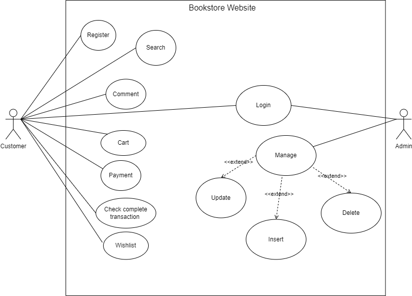

<h4 id="use-case-des">Use Case Description</h4>

<h4 id="activity">Activity Diagram</h4>

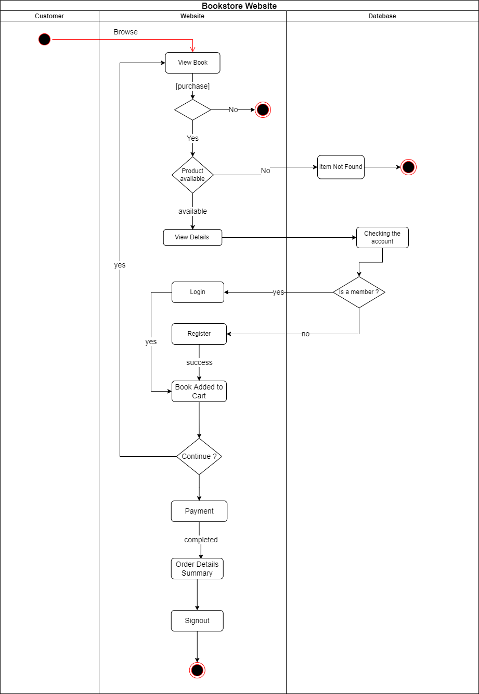

<h4 id="class">Class Diagram</h4>

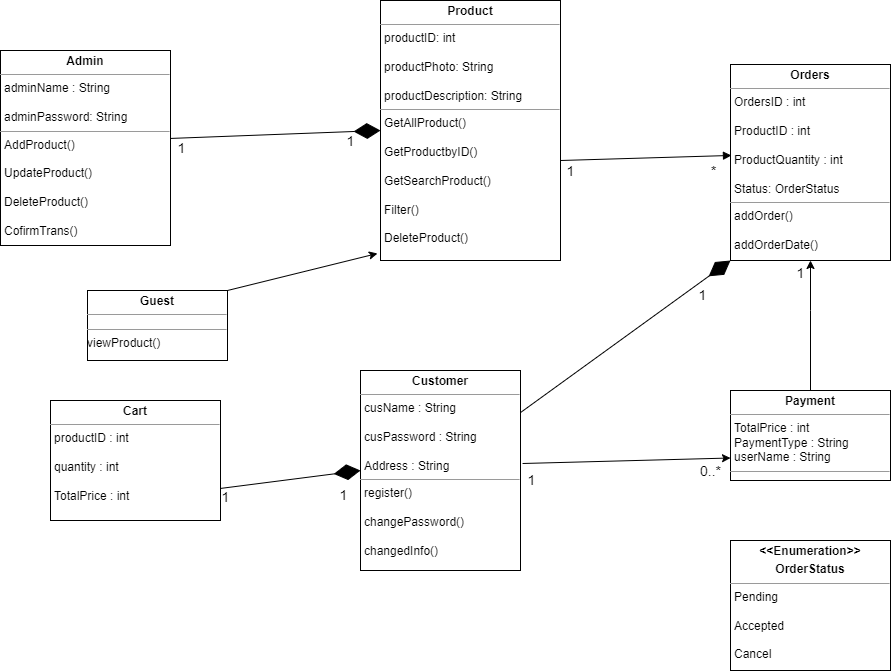

<h4 id="sequence">Sequence Diagram</h4>

- Register

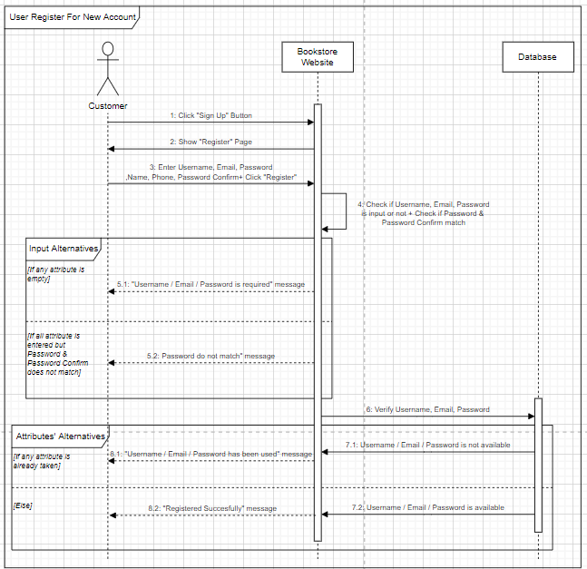

- Login

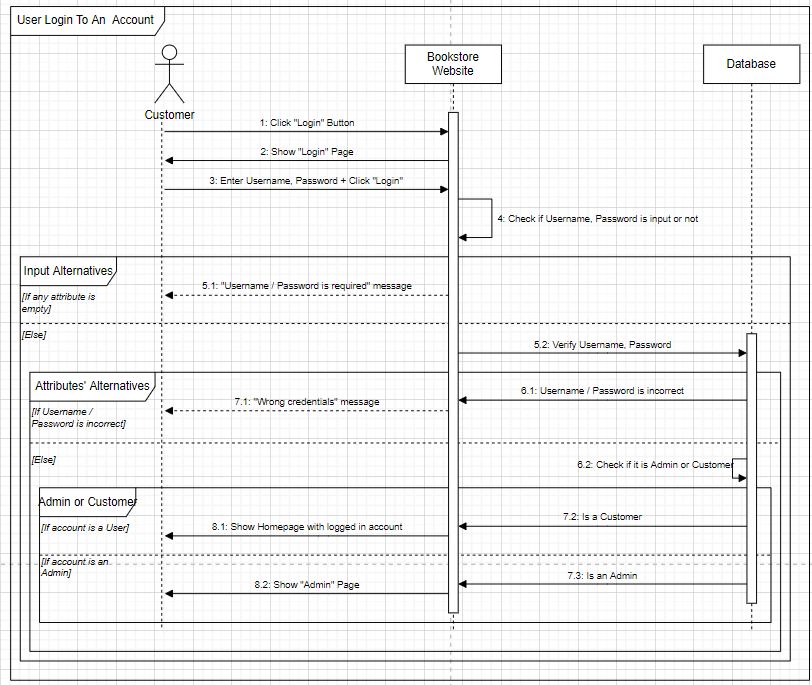

- Search By Keyword

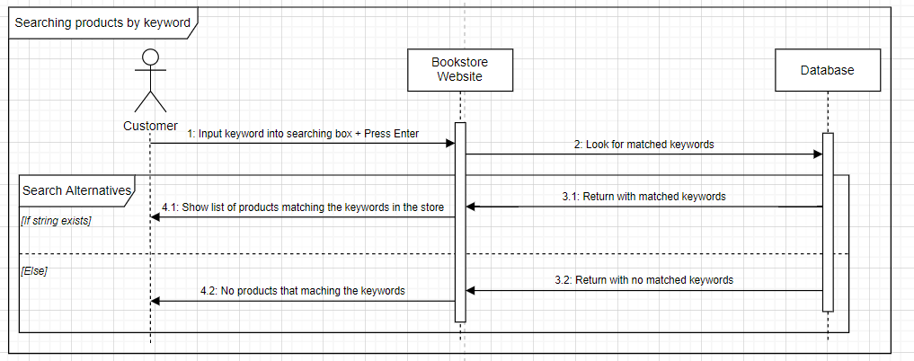

- Search By Filter

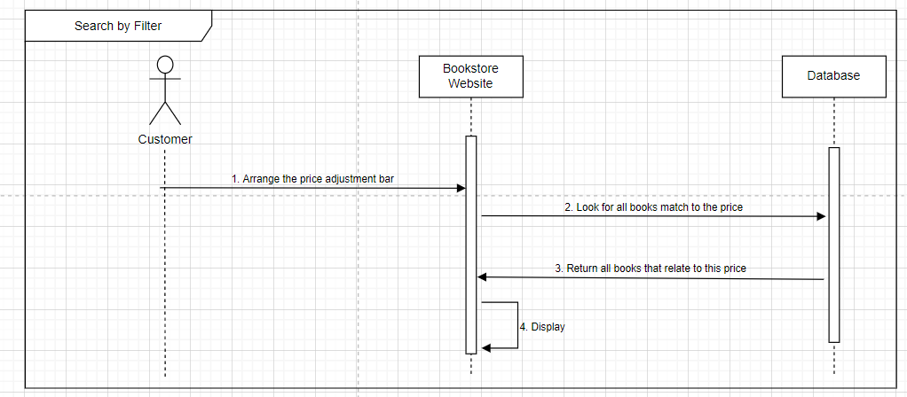

- Catagories

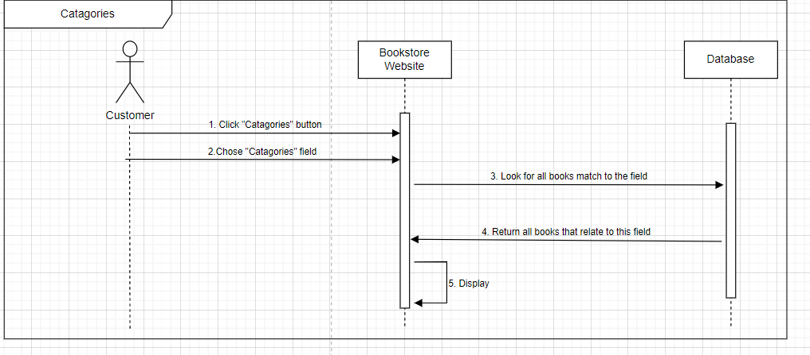

- Cart

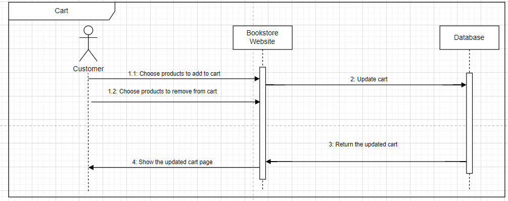

- WishList

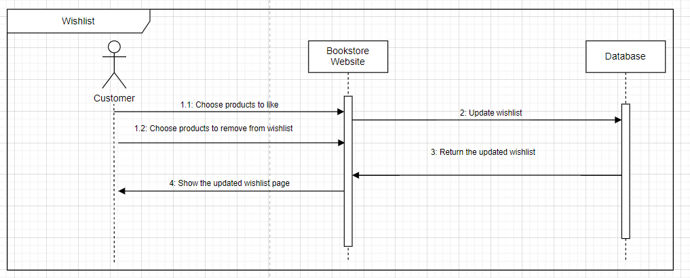

- Review

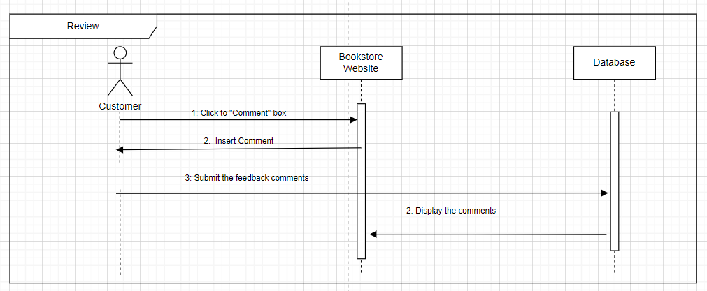

- Payment

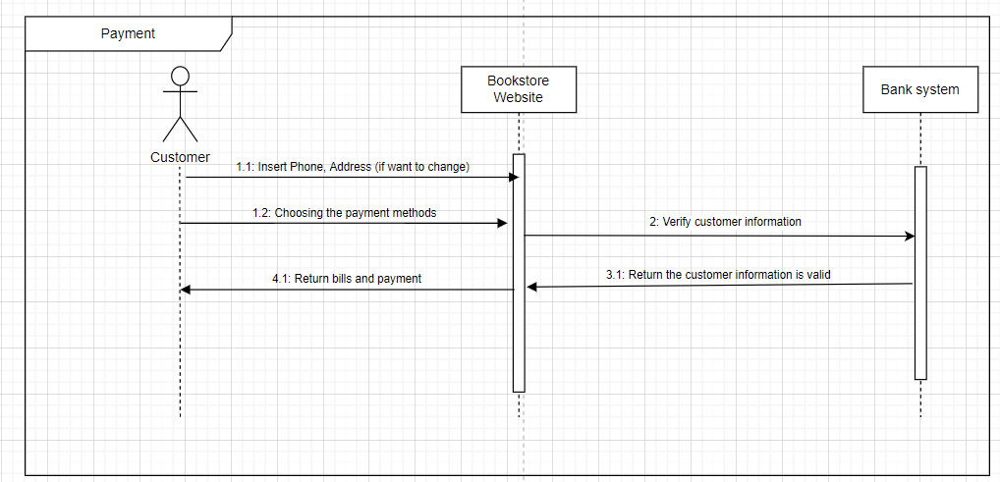

- Transaction Log

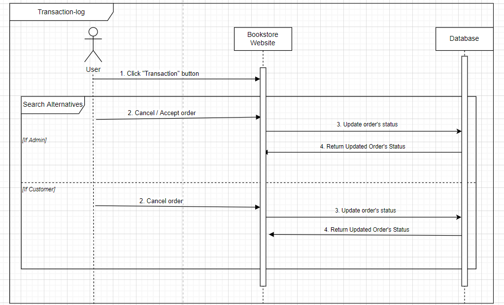

- Admin Management

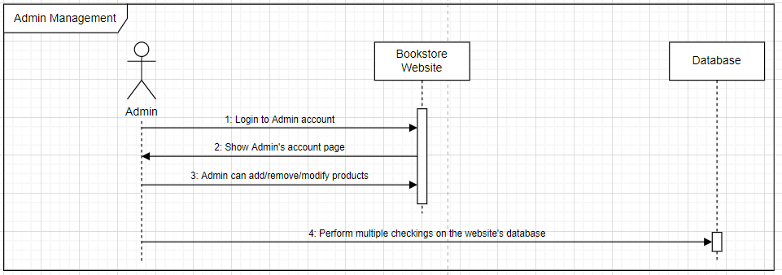

<h4 id="sequence-overall">Sequence Diagram overall</h4>

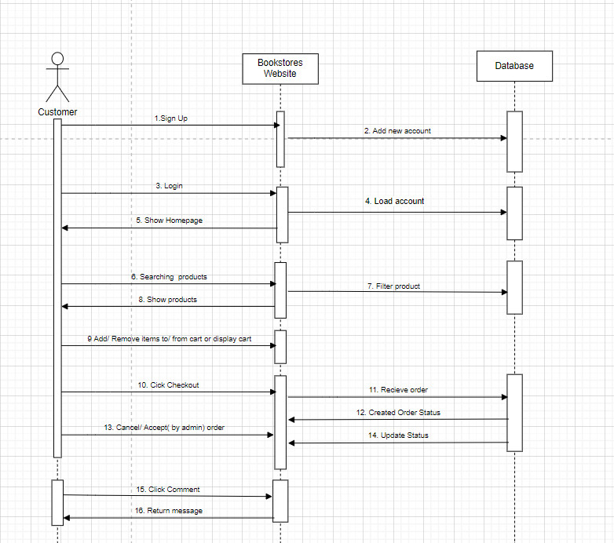

<h3 id="implementation">Implementation</h3>
<h4 id="model-processing-model">Software Processing Model</h4>
- While working on this project, our team employs the Agile model. The agile process model is a software development approach that is iterative in nature. We divided our project into smaller sprints using the Agile method: Account Sprint, User Sprint, Admin Sprint, and Driver Sprint. In the Account sprint, we continue to divide this sprint into many tasks such as sign in, sign up, forget password, etc. Each sprint lasts 1-2 weeks and includes six iterative phases: requirement, design, development, testing, deployment, and review. The division of the entire project into minor parts aids in the reduction of project risk and the overall project delivery time requirement. All members work on each sprint together; after running small test cases for each sprint, we quickly implement it again so that it does not interfere with other phases. - The agile model allows us to save time by improving our code, adding more features, or removing them.

<h4 id="execution">Execution</h4>

<h3 id="testing">Testing</h3>
In this chapter, we are using the template in the lab session to test all functions in our projects to make sure that all functions run smoothly.
We have recorded testing process:
<h3 id="conclusion">Conclusion</h3>

#### Accomplished Works
By the end of the project, the website can perform the following tasks:
- The system allows Users to authenticate accounts. 
- The system allows Users to view their personal information. 
- The system allows Users to use password recovery. 
- The system allows Users to view, purchase  their cart
- The system allows Users to make a wishlist
- The system allows Admin to add new products. 
#### Future Application
Future work will entail building the remaining planned features in order to have a fully functional version of the web application. These features are: 
- Allowing users to add media to their profiles allows them to further personalize their profiles. 
- Implementing the sponsors' dashboard for managing their campaigns through room clustering and connecting. 
- App development for applications such as the Apple iPhone, iPad and Windows Phone App distribution via digital distribution networks such as Google Play and the iOS App Store. 
- The use of semantic web technologies to define relationships in a social network.

<h3 id="references">References</h3>

